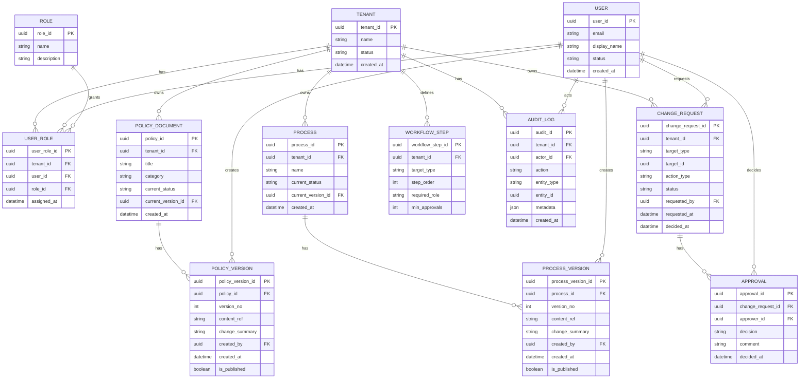

# Domain Data Model

This is the initial simplified baseline model for the application.

## Scope

- Multi-tenant policy and process storage
- RBAC authorization
- Change requests with approvals (four-eye principle)
- Basic versioning on policy and process content
- Central audit logging

## Initial ERD

## Core relationships

- `tenant` owns policy documents, processes, change requests, workflow steps, and audit logs.
- `user` gets tenant-specific roles through `user_role`.
- `policy_document` and `process` are versioned through their version tables.
- `change_request` drives updates and is approved through `approval` records.
- `audit_log` captures key user and system actions.

## Four-eye baseline rule

A `change_request` can move to `APPROVED` only when:

- at least two distinct users approved, and
- requester is not one of the approvers.
