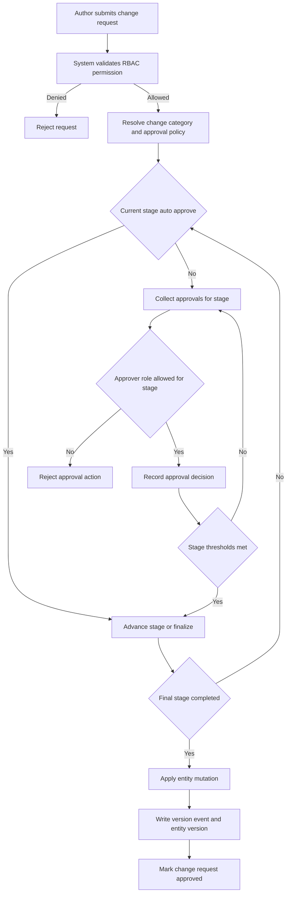
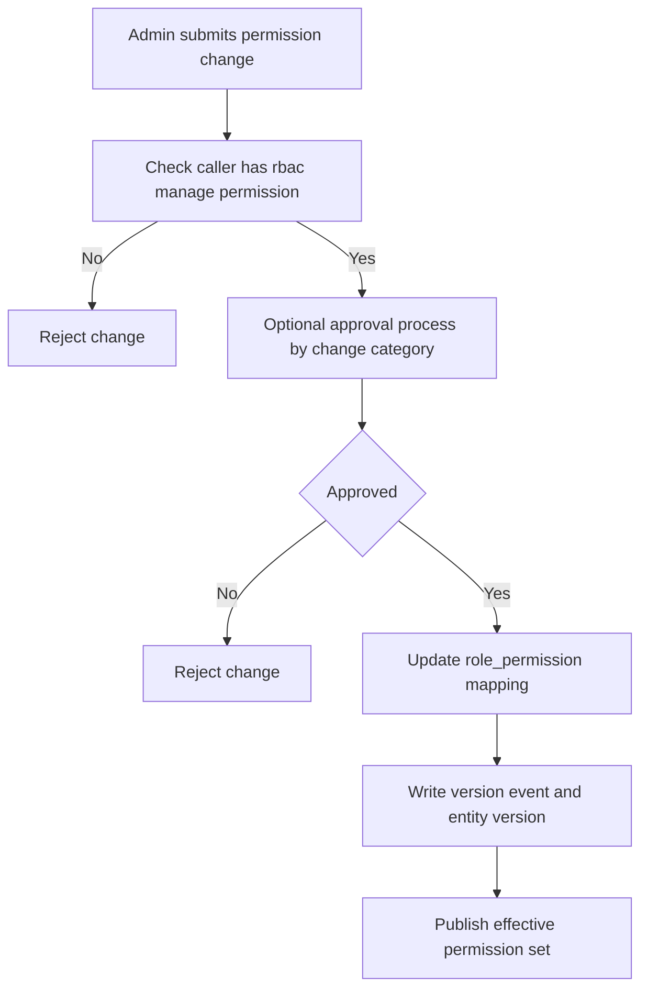
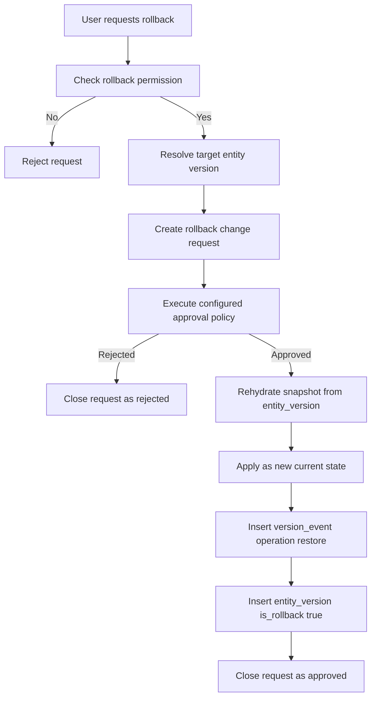

# Domain Data Model And Workflows

This document defines the multi-tenant data model for policy and process governance, including RBAC, configurable approval policies, version control, ownership, and cross-linking between policy and process artifacts.

## Scope

- Multi-tenant isolation
- RBAC with editable role permissions by tenant admins
- Change management with configurable approval levels
- Global version event log and immutable version snapshots
- Owner assignments for policy/process entities
- Policy-process traceability links
- Tenant-specific settings

## Full ERD

```mermaid
erDiagram
    TENANT {
      uuid tenant_id PK
      string name
      string status
      datetime created_at
    }

    USER {
      uuid user_id PK
      string email
      string display_name
      string status
      datetime created_at
    }

    TENANT_USER {
      uuid tenant_user_id PK
      uuid tenant_id FK
      uuid user_id FK
      string membership_status
      datetime joined_at
    }

    OWNER {
      uuid owner_id PK
      uuid tenant_id FK
      uuid user_id FK
      string owner_status
      datetime created_at
    }

    ROLE {
      uuid role_id PK
      uuid tenant_id FK
      string code
      string name
      boolean is_system
      boolean is_mutable
      datetime created_at
    }

    PERMISSION {
      uuid permission_id PK
      string resource
      string action
      string description
    }

    ROLE_PERMISSION {
      uuid role_permission_id PK
      uuid tenant_id FK
      uuid role_id FK
      uuid permission_id FK
      boolean is_allowed
      datetime granted_at
    }

    USER_ROLE {
      uuid user_role_id PK
      uuid tenant_id FK
      uuid user_id FK
      uuid role_id FK
      datetime assigned_at
    }

    POLICY_DOCUMENT {
      uuid policy_id PK
      uuid tenant_id FK
      string title
      string status
      uuid primary_owner_id FK
      int current_version_no
      datetime created_at
    }

    POLICY_EXCERPT {
      uuid excerpt_id PK
      uuid tenant_id FK
      uuid policy_id FK
      int excerpt_order
      string title
      string blob_ref
      string status
      uuid primary_owner_id FK
      int current_version_no
      datetime created_at
    }

    PROCESS {
      uuid process_id PK
      uuid tenant_id FK
      string name
      string status
      uuid primary_owner_id FK
      int current_version_no
      datetime created_at
    }

    PROCESS_STEP {
      uuid step_id PK
      uuid tenant_id FK
      uuid process_id FK
      int step_order
      string title
      string blob_ref
      string status
      uuid primary_owner_id FK
      int current_version_no
      datetime created_at
    }

    WORKFLOW {
      uuid workflow_id PK
      uuid tenant_id FK
      string name
      string status
      datetime created_at
    }

    WORKFLOW_STEP {
      uuid workflow_step_id PK
      uuid tenant_id FK
      uuid workflow_id FK
      int step_order
      string name
      string config_blob_ref
      string status
      datetime created_at
    }

    CATEGORY {
      uuid category_id PK
      uuid tenant_id FK
      string name
      string category_scope
      string status
    }

    POLICY_DOCUMENT_CATEGORY {
      uuid policy_document_category_id PK
      uuid tenant_id FK
      uuid policy_id FK
      uuid category_id FK
    }

    PROCESS_STEP_CATEGORY {
      uuid process_step_category_id PK
      uuid tenant_id FK
      uuid step_id FK
      uuid category_id FK
    }

    POLICY_PROCESS_LINK {
      uuid policy_process_link_id PK
      uuid tenant_id FK
      uuid policy_id FK
      uuid process_id FK
      string link_type
      uuid created_by FK
      datetime created_at
    }

    EXCERPT_STEP_LINK {
      uuid excerpt_step_link_id PK
      uuid tenant_id FK
      uuid excerpt_id FK
      uuid step_id FK
      string link_type
      uuid created_by FK
      datetime created_at
    }

    APPROVAL_POLICY {
      uuid approval_policy_id PK
      uuid tenant_id FK
      string name
      string policy_mode
      boolean is_active
      datetime created_at
    }

    APPROVAL_STAGE {
      uuid approval_stage_id PK
      uuid tenant_id FK
      uuid approval_policy_id FK
      int stage_order
      string stage_name
      int min_distinct_approvers
      boolean require_requester_exclusion
      boolean auto_approve
    }

    APPROVAL_STAGE_ROLE {
      uuid approval_stage_role_id PK
      uuid tenant_id FK
      uuid approval_stage_id FK
      uuid role_id FK
      int min_approvals_from_role
    }

    CHANGE_CATEGORY {
      uuid change_category_id PK
      uuid tenant_id FK
      string name
      string description
      uuid approval_policy_id FK
      boolean is_active
    }

    CHANGE_REQUEST {
      uuid change_request_id PK
      uuid tenant_id FK
      uuid change_category_id FK
      string target_type
      uuid target_id
      string action_type
      string status
      int current_stage_order
      uuid requested_by FK
      datetime requested_at
      datetime decided_at
    }

    APPROVAL {
      uuid approval_id PK
      uuid tenant_id FK
      uuid change_request_id FK
      uuid approval_stage_id FK
      uuid approver_id FK
      uuid approver_role_id FK
      string decision
      string comment
      datetime decided_at
    }

    VERSION_EVENT {
      uuid event_id PK
      uuid tenant_id FK
      bigint global_seq
      string entity_type
      uuid entity_id
      string operation
      uuid actor_user_id FK
      uuid change_request_id FK
      string correlation_id
      string before_blob_ref
      string after_blob_ref
      datetime occurred_at
    }

    ENTITY_VERSION {
      uuid entity_version_id PK
      uuid tenant_id FK
      string entity_type
      uuid entity_id
      int version_no
      string snapshot_blob_ref
      string snapshot_hash
      uuid source_event_id FK
      uuid created_by FK
      boolean is_rollback
      uuid reverted_from_entity_version_id FK
      datetime created_at
    }

    TENANT_SETTING {
      uuid tenant_setting_id PK
      uuid tenant_id FK
      string setting_key
      json value_json
      boolean is_encrypted
      uuid updated_by FK
      datetime updated_at
    }

    TENANT ||--o{ TENANT_USER : has
    USER ||--o{ TENANT_USER : joins

    TENANT ||--o{ OWNER : has
    USER ||--o{ OWNER : feeds

    TENANT ||--o{ ROLE : defines
    ROLE ||--o{ ROLE_PERMISSION : grants
    PERMISSION ||--o{ ROLE_PERMISSION : maps
    USER ||--o{ USER_ROLE : assigned
    ROLE ||--o{ USER_ROLE : granted
    TENANT ||--o{ USER_ROLE : scopes

    TENANT ||--o{ POLICY_DOCUMENT : owns
    POLICY_DOCUMENT ||--o{ POLICY_EXCERPT : contains
    TENANT ||--o{ PROCESS : owns
    PROCESS ||--o{ PROCESS_STEP : contains
    TENANT ||--o{ WORKFLOW : owns
    WORKFLOW ||--o{ WORKFLOW_STEP : contains

    OWNER ||--o{ POLICY_DOCUMENT : owns
    OWNER ||--o{ POLICY_EXCERPT : owns
    OWNER ||--o{ PROCESS : owns
    OWNER ||--o{ PROCESS_STEP : owns

    TENANT ||--o{ CATEGORY : defines
    POLICY_DOCUMENT ||--o{ POLICY_DOCUMENT_CATEGORY : tagged
    CATEGORY ||--o{ POLICY_DOCUMENT_CATEGORY : used_by
    PROCESS_STEP ||--o{ PROCESS_STEP_CATEGORY : tagged
    CATEGORY ||--o{ PROCESS_STEP_CATEGORY : used_by

    POLICY_DOCUMENT ||--o{ POLICY_PROCESS_LINK : linked_to
    PROCESS ||--o{ POLICY_PROCESS_LINK : linked_to
    POLICY_EXCERPT ||--o{ EXCERPT_STEP_LINK : linked_to
    PROCESS_STEP ||--o{ EXCERPT_STEP_LINK : linked_to

    TENANT ||--o{ APPROVAL_POLICY : defines
    APPROVAL_POLICY ||--o{ APPROVAL_STAGE : contains
    APPROVAL_STAGE ||--o{ APPROVAL_STAGE_ROLE : requires
    ROLE ||--o{ APPROVAL_STAGE_ROLE : eligible_role

    TENANT ||--o{ CHANGE_CATEGORY : defines
    APPROVAL_POLICY ||--o{ CHANGE_CATEGORY : used_by
    CHANGE_CATEGORY ||--o{ CHANGE_REQUEST : classifies
    USER ||--o{ CHANGE_REQUEST : requests
    CHANGE_REQUEST ||--o{ APPROVAL : has
    APPROVAL_STAGE ||--o{ APPROVAL : stage_decision
    USER ||--o{ APPROVAL : approves
    ROLE ||--o{ APPROVAL : approves_as

    TENANT ||--o{ VERSION_EVENT : logs
    USER ||--o{ VERSION_EVENT : acts
    CHANGE_REQUEST ||--o{ VERSION_EVENT : traces
    VERSION_EVENT ||--o{ ENTITY_VERSION : materializes
    TENANT ||--o{ ENTITY_VERSION : stores
    USER ||--o{ ENTITY_VERSION : creates
    ENTITY_VERSION ||--o{ ENTITY_VERSION : rolled_back_from

    TENANT ||--o{ TENANT_SETTING : configures
    USER ||--o{ TENANT_SETTING : updates
```

## Table Dictionary

Notes:
- Types are shown as PostgreSQL-oriented logical types.
- `FK` indicates whether the field is a foreign key column.
- Relationship detail is listed in the next section.

### `tenant`

| Column | Type | FK | Description |
|---|---|---|---|
| `tenant_id` | `uuid` | No | Tenant identifier. |
| `name` | `varchar(255)` | No | Tenant display name. |
| `status` | `varchar(32)` | No | Tenant lifecycle state. |
| `created_at` | `timestamptz` | No | Creation timestamp. |

### `user`

| Column | Type | FK | Description |
|---|---|---|---|
| `user_id` | `uuid` | No | User identifier. |
| `email` | `varchar(320)` | No | User login and contact email. |
| `display_name` | `varchar(255)` | No | User full name. |
| `status` | `varchar(32)` | No | Account lifecycle state. |
| `created_at` | `timestamptz` | No | Creation timestamp. |

### `tenant_user`

| Column | Type | FK | Description |
|---|---|---|---|
| `tenant_user_id` | `uuid` | No | Membership identifier. |
| `tenant_id` | `uuid` | Yes | References `tenant.tenant_id`. |
| `user_id` | `uuid` | Yes | References `user.user_id`. |
| `membership_status` | `varchar(32)` | No | Membership status in tenant. |
| `joined_at` | `timestamptz` | No | Membership start timestamp. |

### `owner`

| Column | Type | FK | Description |
|---|---|---|---|
| `owner_id` | `uuid` | No | Owner profile identifier. |
| `tenant_id` | `uuid` | Yes | References `tenant.tenant_id`. |
| `user_id` | `uuid` | Yes | References `user.user_id`. |
| `owner_status` | `varchar(32)` | No | Owner assignment status. |
| `created_at` | `timestamptz` | No | Creation timestamp. |

### `role`

| Column | Type | FK | Description |
|---|---|---|---|
| `role_id` | `uuid` | No | Role identifier. |
| `tenant_id` | `uuid` | Yes | References `tenant.tenant_id`. |
| `code` | `varchar(64)` | No | Stable role code (for example `ADMIN`). |
| `name` | `varchar(128)` | No | Human readable role name. |
| `is_system` | `boolean` | No | Marks protected system role. |
| `is_mutable` | `boolean` | No | Whether role can be edited by tenant admins. |
| `created_at` | `timestamptz` | No | Creation timestamp. |

### `permission`

| Column | Type | FK | Description |
|---|---|---|---|
| `permission_id` | `uuid` | No | Permission identifier. |
| `resource` | `varchar(64)` | No | Protected resource name. |
| `action` | `varchar(32)` | No | CRUD or domain action. |
| `description` | `text` | No | Permission description. |

### `role_permission`

| Column | Type | FK | Description |
|---|---|---|---|
| `role_permission_id` | `uuid` | No | Mapping identifier. |
| `tenant_id` | `uuid` | Yes | References `tenant.tenant_id`. |
| `role_id` | `uuid` | Yes | References `role.role_id`. |
| `permission_id` | `uuid` | Yes | References `permission.permission_id`. |
| `is_allowed` | `boolean` | No | Allow or deny for role-permission pair. |
| `granted_at` | `timestamptz` | No | Grant timestamp. |

### `user_role`

| Column | Type | FK | Description |
|---|---|---|---|
| `user_role_id` | `uuid` | No | Assignment identifier. |
| `tenant_id` | `uuid` | Yes | References `tenant.tenant_id`. |
| `user_id` | `uuid` | Yes | References `user.user_id`. |
| `role_id` | `uuid` | Yes | References `role.role_id`. |
| `assigned_at` | `timestamptz` | No | Assignment timestamp. |

### `policy_document`

| Column | Type | FK | Description |
|---|---|---|---|
| `policy_id` | `uuid` | No | Policy document identifier. |
| `tenant_id` | `uuid` | Yes | References `tenant.tenant_id`. |
| `title` | `varchar(255)` | No | Policy title. |
| `status` | `varchar(32)` | No | Policy status. |
| `primary_owner_id` | `uuid` | Yes | References `owner.owner_id`. |
| `current_version_no` | `integer` | No | Current applied version number. |
| `created_at` | `timestamptz` | No | Creation timestamp. |

### `policy_excerpt`

| Column | Type | FK | Description |
|---|---|---|---|
| `excerpt_id` | `uuid` | No | Policy excerpt identifier. |
| `tenant_id` | `uuid` | Yes | References `tenant.tenant_id`. |
| `policy_id` | `uuid` | Yes | References `policy_document.policy_id`. |
| `excerpt_order` | `integer` | No | Position in policy document. |
| `title` | `varchar(255)` | No | Excerpt title. |
| `blob_ref` | `varchar(512)` | No | Content blob reference. |
| `status` | `varchar(32)` | No | Excerpt status. |
| `primary_owner_id` | `uuid` | Yes | References `owner.owner_id`. |
| `current_version_no` | `integer` | No | Current applied version number. |
| `created_at` | `timestamptz` | No | Creation timestamp. |

### `process`

| Column | Type | FK | Description |
|---|---|---|---|
| `process_id` | `uuid` | No | Process identifier. |
| `tenant_id` | `uuid` | Yes | References `tenant.tenant_id`. |
| `name` | `varchar(255)` | No | Process name. |
| `status` | `varchar(32)` | No | Process status. |
| `primary_owner_id` | `uuid` | Yes | References `owner.owner_id`. |
| `current_version_no` | `integer` | No | Current applied version number. |
| `created_at` | `timestamptz` | No | Creation timestamp. |

### `process_step`

| Column | Type | FK | Description |
|---|---|---|---|
| `step_id` | `uuid` | No | Process step identifier. |
| `tenant_id` | `uuid` | Yes | References `tenant.tenant_id`. |
| `process_id` | `uuid` | Yes | References `process.process_id`. |
| `step_order` | `integer` | No | Sequence in process. |
| `title` | `varchar(255)` | No | Step title. |
| `blob_ref` | `varchar(512)` | No | Step content blob reference. |
| `status` | `varchar(32)` | No | Step status. |
| `primary_owner_id` | `uuid` | Yes | References `owner.owner_id`. |
| `current_version_no` | `integer` | No | Current applied version number. |
| `created_at` | `timestamptz` | No | Creation timestamp. |

### `workflow`

| Column | Type | FK | Description |
|---|---|---|---|
| `workflow_id` | `uuid` | No | Workflow identifier. |
| `tenant_id` | `uuid` | Yes | References `tenant.tenant_id`. |
| `name` | `varchar(255)` | No | Workflow name. |
| `status` | `varchar(32)` | No | Workflow status. |
| `created_at` | `timestamptz` | No | Creation timestamp. |

### `workflow_step`

| Column | Type | FK | Description |
|---|---|---|---|
| `workflow_step_id` | `uuid` | No | Workflow step identifier. |
| `tenant_id` | `uuid` | Yes | References `tenant.tenant_id`. |
| `workflow_id` | `uuid` | Yes | References `workflow.workflow_id`. |
| `step_order` | `integer` | No | Sequence in workflow. |
| `name` | `varchar(255)` | No | Step name. |
| `config_blob_ref` | `varchar(512)` | No | Step configuration blob reference. |
| `status` | `varchar(32)` | No | Step status. |
| `created_at` | `timestamptz` | No | Creation timestamp. |

### `category`

| Column | Type | FK | Description |
|---|---|---|---|
| `category_id` | `uuid` | No | Category identifier. |
| `tenant_id` | `uuid` | Yes | References `tenant.tenant_id`. |
| `name` | `varchar(255)` | No | Category name. |
| `category_scope` | `varchar(64)` | No | Scope, for example `POLICY_DOCUMENT` or `PROCESS_STEP`. |
| `status` | `varchar(32)` | No | Category status. |

### `policy_document_category`

| Column | Type | FK | Description |
|---|---|---|---|
| `policy_document_category_id` | `uuid` | No | Mapping identifier. |
| `tenant_id` | `uuid` | Yes | References `tenant.tenant_id`. |
| `policy_id` | `uuid` | Yes | References `policy_document.policy_id`. |
| `category_id` | `uuid` | Yes | References `category.category_id`. |

### `process_step_category`

| Column | Type | FK | Description |
|---|---|---|---|
| `process_step_category_id` | `uuid` | No | Mapping identifier. |
| `tenant_id` | `uuid` | Yes | References `tenant.tenant_id`. |
| `step_id` | `uuid` | Yes | References `process_step.step_id`. |
| `category_id` | `uuid` | Yes | References `category.category_id`. |

### `policy_process_link`

| Column | Type | FK | Description |
|---|---|---|---|
| `policy_process_link_id` | `uuid` | No | Link identifier. |
| `tenant_id` | `uuid` | Yes | References `tenant.tenant_id`. |
| `policy_id` | `uuid` | Yes | References `policy_document.policy_id`. |
| `process_id` | `uuid` | Yes | References `process.process_id`. |
| `link_type` | `varchar(64)` | No | Relationship type between policy and process. |
| `created_by` | `uuid` | Yes | References `user.user_id`. |
| `created_at` | `timestamptz` | No | Link creation timestamp. |

### `excerpt_step_link`

| Column | Type | FK | Description |
|---|---|---|---|
| `excerpt_step_link_id` | `uuid` | No | Link identifier. |
| `tenant_id` | `uuid` | Yes | References `tenant.tenant_id`. |
| `excerpt_id` | `uuid` | Yes | References `policy_excerpt.excerpt_id`. |
| `step_id` | `uuid` | Yes | References `process_step.step_id`. |
| `link_type` | `varchar(64)` | No | Relationship type between excerpt and step. |
| `created_by` | `uuid` | Yes | References `user.user_id`. |
| `created_at` | `timestamptz` | No | Link creation timestamp. |

### `approval_policy`

| Column | Type | FK | Description |
|---|---|---|---|
| `approval_policy_id` | `uuid` | No | Approval policy identifier. |
| `tenant_id` | `uuid` | Yes | References `tenant.tenant_id`. |
| `name` | `varchar(255)` | No | Policy name. |
| `policy_mode` | `varchar(32)` | No | Mode, for example staged or auto. |
| `is_active` | `boolean` | No | Active policy marker. |
| `created_at` | `timestamptz` | No | Creation timestamp. |

### `approval_stage`

| Column | Type | FK | Description |
|---|---|---|---|
| `approval_stage_id` | `uuid` | No | Stage identifier. |
| `tenant_id` | `uuid` | Yes | References `tenant.tenant_id`. |
| `approval_policy_id` | `uuid` | Yes | References `approval_policy.approval_policy_id`. |
| `stage_order` | `integer` | No | Sequence within policy. |
| `stage_name` | `varchar(255)` | No | Stage name (for example `MANAGER`). |
| `min_distinct_approvers` | `integer` | No | Distinct approvers required in stage. |
| `require_requester_exclusion` | `boolean` | No | Requester cannot approve own change when true. |
| `auto_approve` | `boolean` | No | Stage auto-approval marker. |

### `approval_stage_role`

| Column | Type | FK | Description |
|---|---|---|---|
| `approval_stage_role_id` | `uuid` | No | Stage-role rule identifier. |
| `tenant_id` | `uuid` | Yes | References `tenant.tenant_id`. |
| `approval_stage_id` | `uuid` | Yes | References `approval_stage.approval_stage_id`. |
| `role_id` | `uuid` | Yes | References `role.role_id`. |
| `min_approvals_from_role` | `integer` | No | Minimum approvals required from this role. |

### `change_category`

| Column | Type | FK | Description |
|---|---|---|---|
| `change_category_id` | `uuid` | No | Change category identifier. |
| `tenant_id` | `uuid` | Yes | References `tenant.tenant_id`. |
| `name` | `varchar(255)` | No | Category name. |
| `description` | `text` | No | Category description. |
| `approval_policy_id` | `uuid` | Yes | References `approval_policy.approval_policy_id`. |
| `is_active` | `boolean` | No | Active category marker. |

### `change_request`

| Column | Type | FK | Description |
|---|---|---|---|
| `change_request_id` | `uuid` | No | Change request identifier. |
| `tenant_id` | `uuid` | Yes | References `tenant.tenant_id`. |
| `change_category_id` | `uuid` | Yes | References `change_category.change_category_id`. |
| `target_type` | `varchar(64)` | No | Target entity type. |
| `target_id` | `uuid` | No | Target entity identifier. |
| `action_type` | `varchar(16)` | No | CRUD action type. |
| `status` | `varchar(32)` | No | Workflow status. |
| `current_stage_order` | `integer` | No | Current approval stage. |
| `requested_by` | `uuid` | Yes | References `user.user_id`. |
| `requested_at` | `timestamptz` | No | Submission timestamp. |
| `decided_at` | `timestamptz` | No | Final decision timestamp. |

### `approval`

| Column | Type | FK | Description |
|---|---|---|---|
| `approval_id` | `uuid` | No | Approval decision identifier. |
| `tenant_id` | `uuid` | Yes | References `tenant.tenant_id`. |
| `change_request_id` | `uuid` | Yes | References `change_request.change_request_id`. |
| `approval_stage_id` | `uuid` | Yes | References `approval_stage.approval_stage_id`. |
| `approver_id` | `uuid` | Yes | References `user.user_id`. |
| `approver_role_id` | `uuid` | Yes | References `role.role_id`. |
| `decision` | `varchar(16)` | No | Decision value (`APPROVE` or `REJECT`). |
| `comment` | `text` | No | Decision comment. |
| `decided_at` | `timestamptz` | No | Decision timestamp. |

### `version_event`

| Column | Type | FK | Description |
|---|---|---|---|
| `event_id` | `uuid` | No | Event identifier. |
| `tenant_id` | `uuid` | Yes | References `tenant.tenant_id`. |
| `global_seq` | `bigint` | No | Tenant-global ordering sequence. |
| `entity_type` | `varchar(64)` | No | Changed entity type. |
| `entity_id` | `uuid` | No | Changed entity identifier. |
| `operation` | `varchar(16)` | No | CRUD operation (`CREATE`, `UPDATE`, `DELETE`, `RESTORE`). |
| `actor_user_id` | `uuid` | Yes | References `user.user_id`. |
| `change_request_id` | `uuid` | Yes | References `change_request.change_request_id`. |
| `correlation_id` | `varchar(128)` | No | Correlation key for grouped actions. |
| `before_blob_ref` | `varchar(512)` | No | Blob reference before change. |
| `after_blob_ref` | `varchar(512)` | No | Blob reference after change. |
| `occurred_at` | `timestamptz` | No | Event timestamp. |

### `entity_version`

| Column | Type | FK | Description |
|---|---|---|---|
| `entity_version_id` | `uuid` | No | Immutable version identifier. |
| `tenant_id` | `uuid` | Yes | References `tenant.tenant_id`. |
| `entity_type` | `varchar(64)` | No | Versioned entity type. |
| `entity_id` | `uuid` | No | Versioned entity identifier. |
| `version_no` | `integer` | No | Monotonic version number per entity. |
| `snapshot_blob_ref` | `varchar(512)` | No | Full snapshot blob reference. |
| `snapshot_hash` | `varchar(128)` | No | Snapshot integrity hash. |
| `source_event_id` | `uuid` | Yes | References `version_event.event_id`. |
| `created_by` | `uuid` | Yes | References `user.user_id`. |
| `is_rollback` | `boolean` | No | Indicates rollback-created version. |
| `reverted_from_entity_version_id` | `uuid` | Yes | Self reference to original version. |
| `created_at` | `timestamptz` | No | Snapshot creation timestamp. |

### `tenant_setting`

| Column | Type | FK | Description |
|---|---|---|---|
| `tenant_setting_id` | `uuid` | No | Setting identifier. |
| `tenant_id` | `uuid` | Yes | References `tenant.tenant_id`. |
| `setting_key` | `varchar(128)` | No | Setting key. |
| `value_json` | `jsonb` | No | Setting payload. |
| `is_encrypted` | `boolean` | No | Sensitive setting marker. |
| `updated_by` | `uuid` | Yes | References `user.user_id`. |
| `updated_at` | `timestamptz` | No | Last update timestamp. |

## Relationships

### Core tenancy and identity

- `tenant 1:N tenant_user`
- `user 1:N tenant_user`
- `tenant 1:N owner`
- `user 1:N owner`

### RBAC

- `tenant 1:N role`
- `role 1:N role_permission`
- `permission 1:N role_permission`
- `user 1:N user_role`
- `role 1:N user_role`

### Policy, process, workflow and ownership

- `tenant 1:N policy_document`
- `policy_document 1:N policy_excerpt`
- `tenant 1:N process`
- `process 1:N process_step`
- `tenant 1:N workflow`
- `workflow 1:N workflow_step`
- `owner 1:N policy_document`
- `owner 1:N policy_excerpt`
- `owner 1:N process`
- `owner 1:N process_step`

### Categorization and links

- `tenant 1:N category`
- `policy_document 1:N policy_document_category`
- `category 1:N policy_document_category`
- `process_step 1:N process_step_category`
- `category 1:N process_step_category`
- `policy_document 1:N policy_process_link`
- `process 1:N policy_process_link`
- `policy_excerpt 1:N excerpt_step_link`
- `process_step 1:N excerpt_step_link`

### Approvals and change governance

- `tenant 1:N approval_policy`
- `approval_policy 1:N approval_stage`
- `approval_stage 1:N approval_stage_role`
- `role 1:N approval_stage_role`
- `tenant 1:N change_category`
- `approval_policy 1:N change_category`
- `change_category 1:N change_request`
- `user 1:N change_request`
- `change_request 1:N approval`
- `approval_stage 1:N approval`
- `user 1:N approval`
- `role 1:N approval`

### Versioning

- `tenant 1:N version_event`
- `user 1:N version_event`
- `change_request 1:N version_event`
- `version_event 1:N entity_version`
- `tenant 1:N entity_version`
- `user 1:N entity_version`
- `entity_version 1:N entity_version` (rollback source relation)

### Tenant settings

- `tenant 1:N tenant_setting`
- `user 1:N tenant_setting`

## Enforced Validation Rules

- Every business entity row includes `tenant_id`; all joins should include tenant-scoped checks.
- RBAC enforcement must check `user_role` and `role_permission` before CRUD.
- Only users with an administrative permission (for example `rbac:manage`) can modify role-permission mappings.
- `change_request` approval path is driven by `change_category -> approval_policy -> approval_stage`.
- `approval.approver_role_id` must be one of the user's assigned roles and one of the allowed stage roles.
- Distinct approver count and requester exclusion are enforced per stage.
- Every change produces `version_event`; state snapshots are persisted in `entity_version`.
- Rollback creates a new `entity_version` with `is_rollback = true` and back-link to source version.
- Policy/process artifacts have explicit owner assignment through `primary_owner_id`.

## High-Level Process Flowcharts

### Change Approval Workflow (policy document, process, workflow, etc.)

### Role Permission Change Workflow

### Version Rollback Workflow

## Implementation Notes

- Recommended unique constraints:
  - `owner (tenant_id, user_id)`
  - `role (tenant_id, code)`
  - `permission (resource, action)`
  - `user_role (tenant_id, user_id, role_id)`
  - `role_permission (tenant_id, role_id, permission_id)`
  - `approval_stage (tenant_id, approval_policy_id, stage_order)`
  - `approval_stage_role (tenant_id, approval_stage_id, role_id)`
  - `change_category (tenant_id, name)`
  - `approval (tenant_id, change_request_id, approval_stage_id, approver_id)`
  - `entity_version (tenant_id, entity_type, entity_id, version_no)`
  - `tenant_setting (tenant_id, setting_key)`
- Recommended indexes:
  - `version_event (tenant_id, global_seq)`
  - `version_event (tenant_id, entity_type, entity_id, occurred_at)`
  - `change_request (tenant_id, status, requested_at)`
  - `approval (tenant_id, change_request_id, approval_stage_id, decision)`

