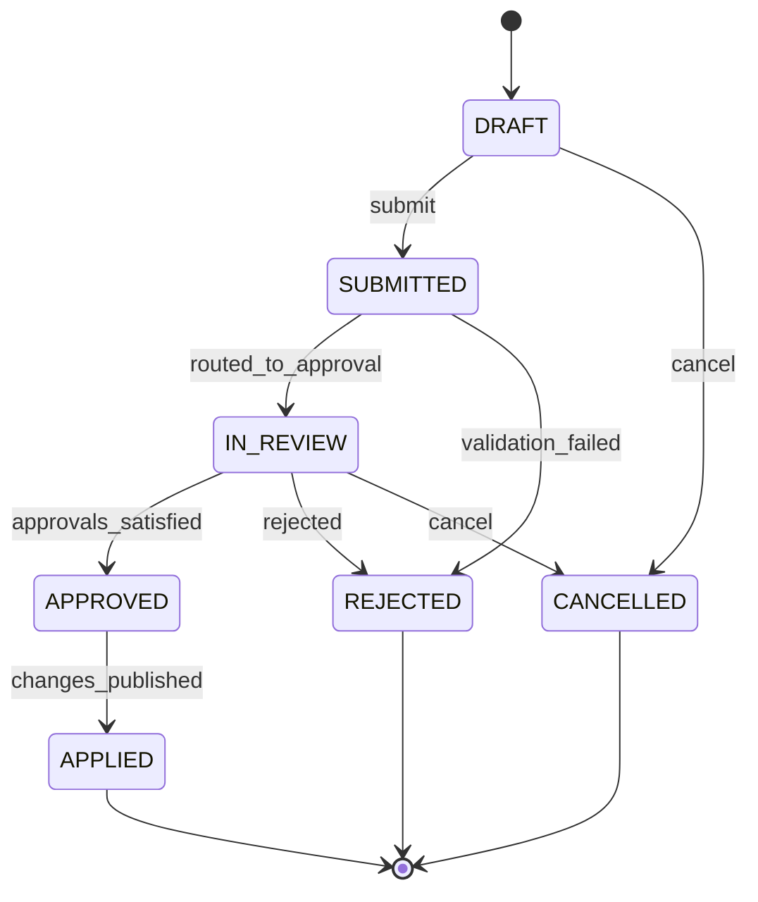
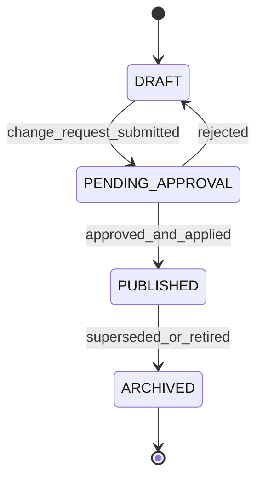

# State Machines

This file reflects the initial baseline model.

## Change Request Lifecycle

## Policy/Process Version Lifecycle

## Minimal enforcement checks

- Requester needs write permission for target entity.
- Requester cannot approve own request.
- At least two distinct approvals required for four-eye.
- Publish applies a new version and writes an audit record.
