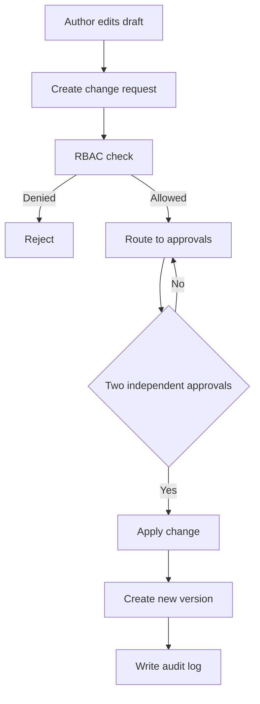
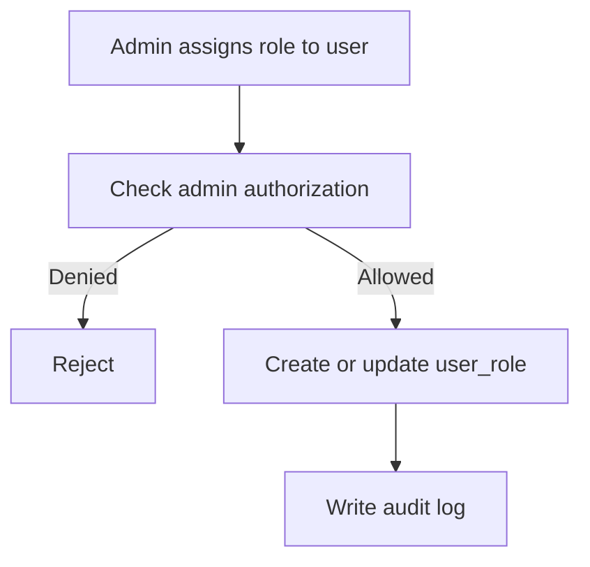
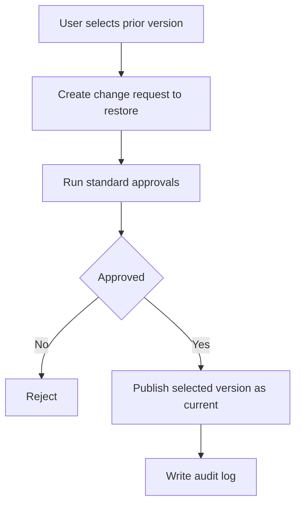

# Application Workflows

This file reflects the initial baseline model.

## Policy or Process Change Workflow

```mermaid
flowchart TD
    A[Author edits draft] --> B[Create change request]
    B --> C[RBAC check]
    C -->|Denied| X[Reject]
    C -->|Allowed| D[Route to approvals]
    D --> E{Two independent approvals}
    E -->|No| D
    E -->|Yes| F[Apply change]
    F --> G[Create new version]
    G --> H[Write audit log]
```

## Role Assignment Workflow

```mermaid
flowchart TD
    A[Admin assigns role to user] --> B[Check admin authorization]
    B -->|Denied| X[Reject]
    B -->|Allowed| C[Create or update user_role]
    C --> D[Write audit log]
```

## Rollback Workflow (Baseline)

```mermaid
flowchart TD
    A[User selects prior version] --> B[Create change request to restore]
    B --> C[Run standard approvals]
    C --> D{Approved}
    D -->|No| X[Reject]
    D -->|Yes| E[Publish selected version as current]
    E --> F[Write audit log]
```
